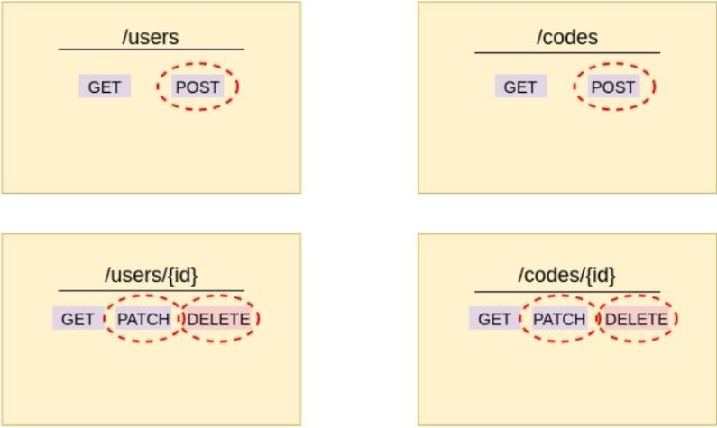

# API RESTful con Node.js y Express

Vamos a construir una **API RESTful** usando Node.js y un marco llamado Express. Más tarde, agregaremos una base de datos a nuestra API para que los datos estén disponibles después de reiniciar el servidor. Además, agregaremos protección a nuestras rutas y solicitudes, para permitir que solo los usuarios autorizados accedan a diferentes partes de la API.

Por supuesto, aprenderás:
- Qué es **Express**
- Cómo crear una API con Express
- Qué es **MongoDB**
- Cómo almacenar datos en MongoDB
- Qué es **JWT**
- Cómo proteger rutas con JWT

Aquí hay un diagrama simple de cuál sería nuestra API.

En la imagen de arriba, cada cuadro amarillo muestra una ruta con los métodos disponibles. Los rodeados de líneas rojas estarán protegidos con JWT.

:::warning IMPORTANTE
Cada una de las tecnologías mencionadas anteriormente - **Express**, **MongoDB** y **JWT** - se explicará durante esta serie por separado. Por lo tanto, no hay requisitos previos para ellos, excepto el propio Node.js.
